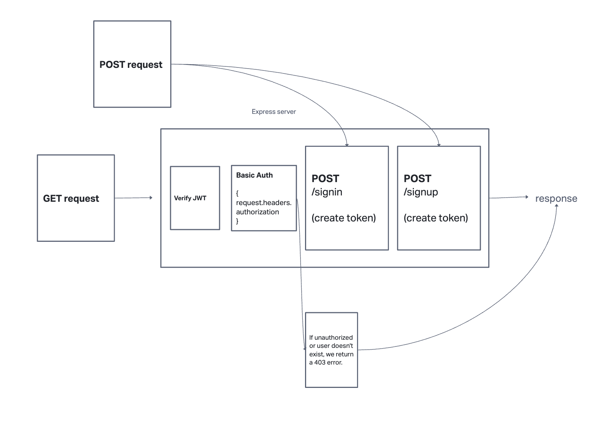

# bearer-auth

Deploy Link: https://bearer-auth-usyn.onrender.com

PR: https://github.com/yd24/bearer-auth/pull/1

GitHub Actions: https://github.com/yd24/bearer-auth/actions

## Notes
To test:
* Sign up an account first by sending a POST request to /signup endpoint and a { "username": "<username here>", "password":"<password here>"} in body.
* Sign into the account with a POST request to /signin endpoint with the account credentials.
* Take the token from the returned object and use it to make a GET request to /users endpoint.
* Token will expire after 30 seconds from sign-in, so should return an invalid login.